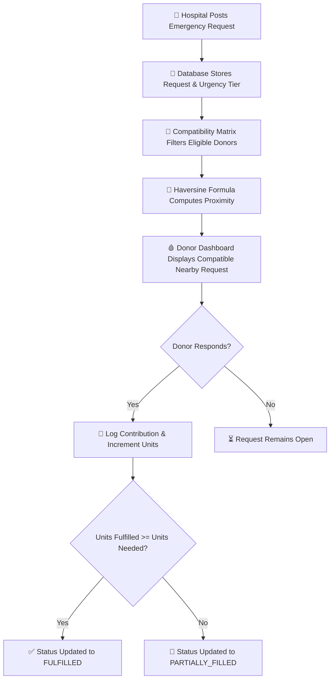
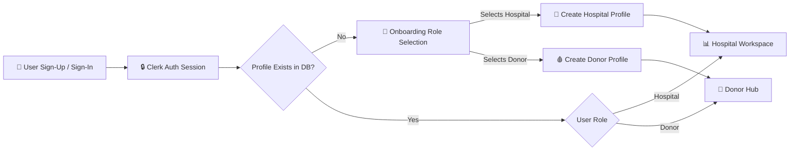

# 🩸 Project BloodBank

> A full-stack emergency blood coordination platform connecting hospitals, donors, and donation drives in real-time.

[](https://nextjs.org/)
[](https://www.typescriptlang.org/)
[](https://www.prisma.io/)
[](https://www.postgresql.org/)
[](https://clerk.com/)
[](https://tailwindcss.com/)
[](LICENSE)
[](https://github.com/Pro1943)

---

## 🚨 Problem Statement

During critical medical emergencies, obtaining compatible blood units within hours or minutes is often the factor that determines survival. Traditional blood coordination relies heavily on manual phone calls, fragmented messaging groups, and out-of-date inventory lists. This creates severe delays for hospitals and friction for willing donors.

**Project BloodBank** solves this by centralizing emergency request dispatching, automated blood compatibility filtering, distance-based sorting, and community drive organization into a unified multi-role web platform.

---

## 🌐 Live Demo & Preview

- **Live Application**: [Live Demo]()
---

## ✨ Key Features

### 🏥 Hospital Workspace
- **⚡ Urgent Request Creation**: Publish blood requests specifying blood type, volume needed, urgency level (`CRITICAL`, `URGENT`, `STANDARD`), and clinical notes.
- **🔄 Dynamic Request Lifecycle**: Automatic status progression (`OPEN` → `PARTIALLY_FILLED` → `FULFILLED`) as donor contributions are logged.
- **👥 Affiliated Donor Registry**: Maintain and monitor registered hospital donors with availability toggle controls.
- **⛺ Blood Drive Scheduling**: Plan community donation camps with location addresses, time windows, and target unit collection goals.
- **📊 Real-time Progress Tracking**: Monitor units collected in active drives with visual progress indicators.

### 🩸 Donor Workspace
- **🧬 Medical Compatibility Matching**: Automated cross-matching ensuring donors only receive alerts for compatible blood types.
- **📍 Haversine Proximity Sorting**: View requests sorted by real-time calculated distance in kilometers from donor location coordinates.
- **⏳ Eligibility Cooldown Tracker**: Visual tracking monitor calculating 56-day/90-day donation interval eligibility.
- **📅 Drive RSVP & Waitlisting**: One-click registration for upcoming community blood drives with capacity enforcement.
- **📞 Direct Hospital Dispatch**: Immediate emergency contact options for nearby hospital drives and coordinators.

### 🔐 Authentication & Onboarding
- **🛡️ Role-Based Access Control**: Managed authentication via Clerk with automatic routing between Hospital and Donor interfaces.
- **🌍 International Phone Validation**: Built-in phone validation supporting multi-country code formats.

---

## 🔄 How It Works

### Core Emergency Request & Donor Matching Flow



### Authentication & Role-Based Routing Flow



---

## 🛠️ Tech Stack

| Category | Technology | Shield | Purpose |
|----------|------------|--------|---------|
| **Framework** | Next.js 16 |  | Server Components, App Router & API routes |
| **Language** | TypeScript |  | Strict type safety across UI, API, and DB |
| **Styling** | Tailwind CSS v4 |  | Modern utility-first design system |
| **Animations** | Framer Motion |  | Fluid micro-interactions and modal transitions |
| **Auth** | Clerk |  | Session management & multi-role middleware |
| **Database** | PostgreSQL |  | Relational database hosted on Neon |
| **ORM** | Prisma ORM |  | Schema modeling and database migration |
| **Deployment** | Vercel |  | Cloud edge hosting |

---

## 📐 Architecture & Technical Highlights

### 1. Blood Type Compatibility Matrix Algorithm

Blood transfusion safety requires matching donor red blood cells with recipient plasma antibodies. The system enforces medical compatibility lookup tables to filter requests strictly by recipient eligibility:

```typescript
const COMPATIBILITY_MAP: Record<string, string[]> = {
  A_POS: ["A_POS", "A_NEG", "O_POS", "O_NEG"],
  A_NEG: ["A_NEG", "O_NEG"],
  B_POS: ["B_POS", "B_NEG", "O_POS", "O_NEG"],
  B_NEG: ["B_NEG", "O_NEG"],
  AB_POS: ["A_POS", "A_NEG", "B_POS", "B_NEG", "AB_POS", "AB_NEG", "O_POS", "O_NEG"],
  AB_NEG: ["A_NEG", "B_NEG", "AB_NEG", "O_NEG"],
  O_POS: ["O_POS", "O_NEG"],
  O_NEG: ["O_NEG"],
};

export function getCompatibleDonorTypes(recipientBloodType: string): string[] {
  return COMPATIBILITY_MAP[recipientBloodType] || [];
}

export function checkBloodCompatibility(donorBloodType: string, recipientBloodType: string): boolean {
  const compatibleTypes = COMPATIBILITY_MAP[recipientBloodType];
  if (!compatibleTypes) {
    return false;
  }
  return compatibleTypes.includes(donorBloodType);
}
```

### 2. Haversine Geospatial Distance Calculation

To evaluate donor proximity to emergency hospital sites without external GIS API latency, distance is computed mathematically on the server using the spherical Haversine formula:

```typescript
export interface Coordinates {
  latitude: number;
  longitude: number;
}

export function calculateDistance(coord1: Coordinates, coord2: Coordinates): number {
  const earthRadiusKm = 6371;

  const dLat = ((coord2.latitude - coord1.latitude) * Math.PI) / 180;
  const dLon = ((coord2.longitude - coord1.longitude) * Math.PI) / 180;

  const lat1 = (coord1.latitude * Math.PI) / 180;
  const lat2 = (coord2.latitude * Math.PI) / 180;

  const a =
    Math.sin(dLat / 2) * Math.sin(dLat / 2) +
    Math.sin(dLon / 2) * Math.sin(dLon / 2) * Math.cos(lat1) * Math.cos(lat2);
  const c = 2 * Math.atan2(Math.sqrt(a), Math.sqrt(1 - a));

  return earthRadiusKm * c;
}
```

### 3. Serverless Database Connection Adapter

To manage connection pooling safely in serverless environments, Prisma uses an explicit PG connection pool with libpq compatibility parameters:

```typescript
import { Pool } from "pg";
import { PrismaPg } from "@prisma/adapter-pg";
import { PrismaClient } from "@prisma/client";

const globalForPrisma = globalThis as unknown as {
  prisma: PrismaClient | undefined;
};

const connectionString = process.env.DATABASE_URL ?? "";

let poolConnectionString = connectionString;
if (poolConnectionString && !/sslmode=/i.test(poolConnectionString)) {
  const sep = poolConnectionString.includes("?") ? "&" : "?";
  poolConnectionString = `${poolConnectionString}${sep}uselibpqcompat=true&sslmode=require`;
}

const pool = new Pool({ connectionString: poolConnectionString });
const adapter = new PrismaPg(pool);

export const db = globalForPrisma.prisma ?? new PrismaClient({ adapter });

if (process.env.NODE_ENV !== "production") {
  globalForPrisma.prisma = db;
}
```

---

## 🚀 Getting Started

### Prerequisites

- **Node.js**: v18.17.0 or higher
- **npm**: v9.0.0 or higher
- **PostgreSQL**: A serverless Postgres database instance (e.g. Neon)
- **Clerk Account**: Keys from the Clerk developer dashboard

### Local Installation

1. **Clone the Repository**
   ```bash
   git clone https://github.com/Pro1943/ProjectBloodBank
   cd ProjectBloodBank
   ```

2. **Install Dependencies**
   ```bash
   npm install
   ```

3. **Set Up Environment Variables**
   Create a `.env` file in the project root directory:
   ```env
   DATABASE_URL=
   NEXT_PUBLIC_CLERK_PUBLISHABLE_KEY=
   CLERK_SECRET_KEY=
   NEXT_PUBLIC_CLERK_SIGN_IN_URL=/sign-in
   NEXT_PUBLIC_CLERK_SIGN_UP_URL=/sign-up
   ```

4. **Synchronize Database Schema**
   ```bash
   npx prisma db push
   ```

5. **Seed Demo Data**
   ```bash
   npm run seed
   ```

6. **Start Development Server**
   ```bash
   npm run dev
   ```

   Navigate to `http://localhost:3000` to access the application.

---

## 📂 Project Structure

```
project_blood_bank/
├── prisma/
│   ├── schema.prisma          # Database schema models (Hospital, Donor, Request, etc.)
│   └── seed.ts                # Seed script for initial demo data
├── src/
│   ├── app/
│   │   ├── api/               # REST API endpoints (camps, requests, donors, hospitals)
│   │   ├── dashboard/         # Hospital workspace routes (requests, donors, camps, overview)
│   │   ├── donor/             # Donor workspace routes (compatible requests, drives, profile)
│   │   ├── onboarding/        # Multi-role setup flow
│   │   ├── sign-in/           # Authentication pages
│   │   ├── sign-up/
│   │   ├── globals.css        # Tailwind CSS import & global styles
│   │   ├── layout.tsx         # Root application layout
│   │   └── page.tsx           # Public landing page
│   ├── components/
│   │   ├── app-shell.tsx      # Sidebar & main container layout
│   │   ├── header-client.tsx  # Header navigation bar with Clerk user button
│   │   └── ui/                # Core component collection (RequestCard, CampCard, etc.)
│   └── lib/
│       ├── blood-compatibility.ts # Medical compatibility matrix matching logic
│       ├── db.ts              # Serverless Prisma DB connection instance
│       ├── distance.ts        # Haversine distance calculator
│       └── utils.ts           # Class merging and formatting helpers
├── public/                    # Static image & vector assets
├── package.json               # Scripts and dependency definitions
└── tsconfig.json              # TypeScript compiler settings
```

---

## 💡 Learning Outcomes

Building **Project BloodBank** provided deep practical insight into:

- **Complex Schema Design**: Designing normalized SQL relationships connecting multi-role users, emergency requests, contributions, and capacity-constrained drives.
- **Mathematical Algorithmic Integration**: Implementing trigonometric geospatial formulas and custom lookup maps inside server-side data workflows.
- **Serverless Resilience**: Resolving connection pool limitations when interfacing ORMs with serverless PostgreSQL databases.
- **Modern UI Architecture**: Structuring a unified web application using React Server Components, client-side dynamic state, and fluid Framer Motion animations.

---

## 📄 License

This project is licensed under the [MIT License](LICENSE).

---

## 👨‍💻 Credits

Built with ❤️ by **[@Pro1943](https://github.com/Pro1943)**.
