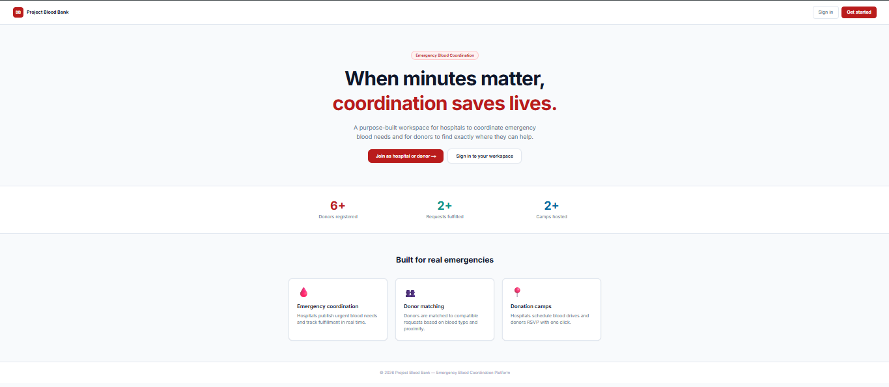
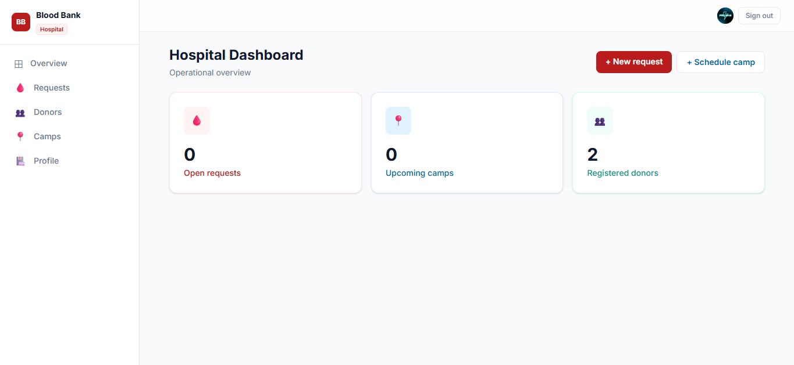
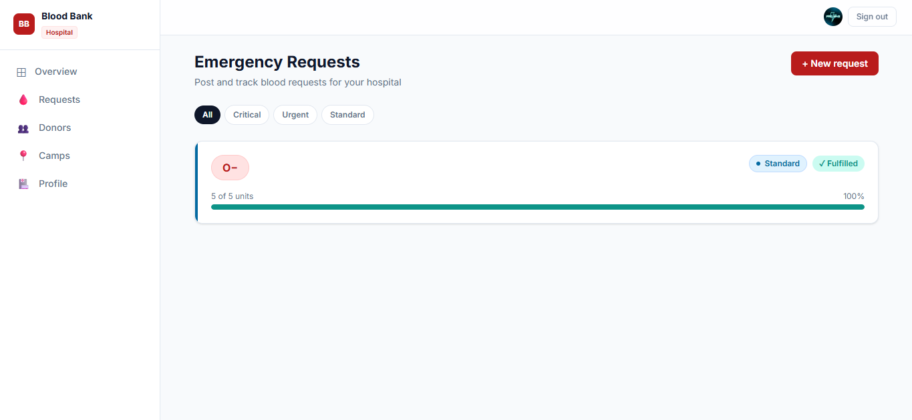
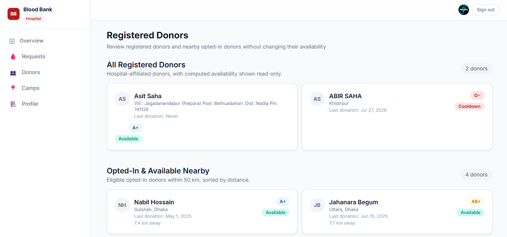
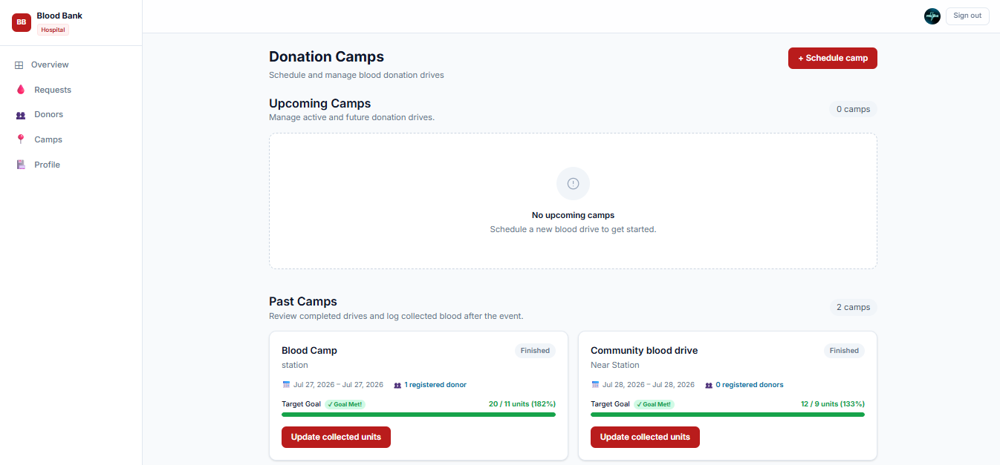
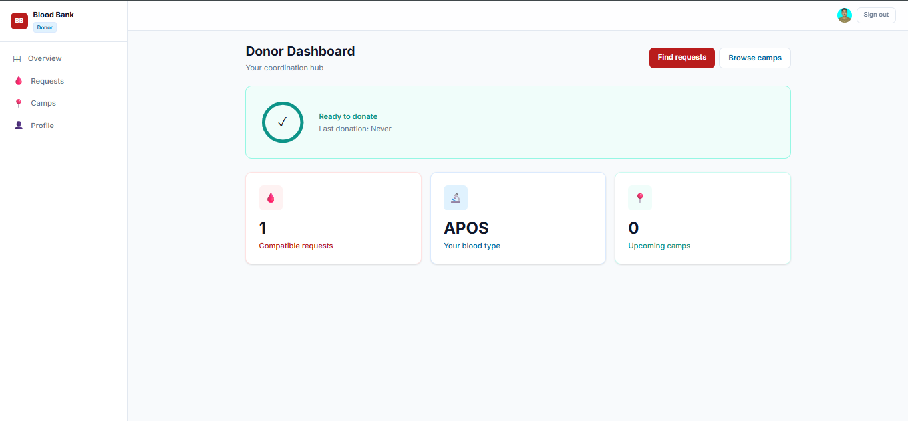
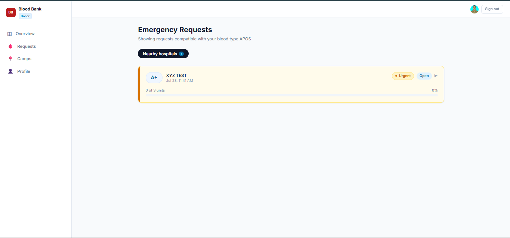
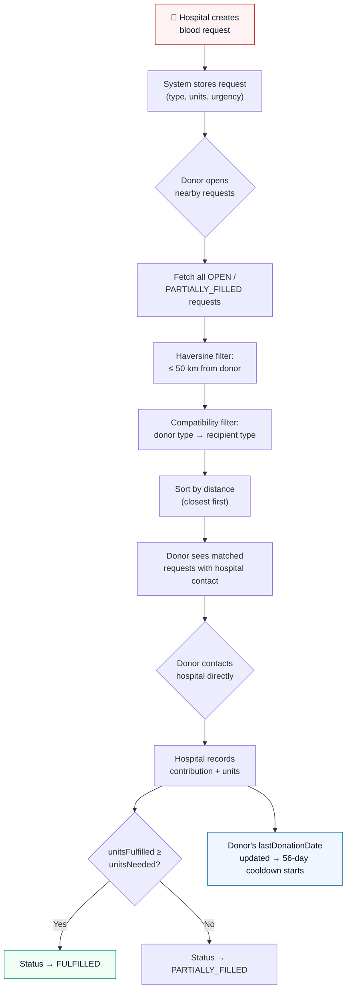
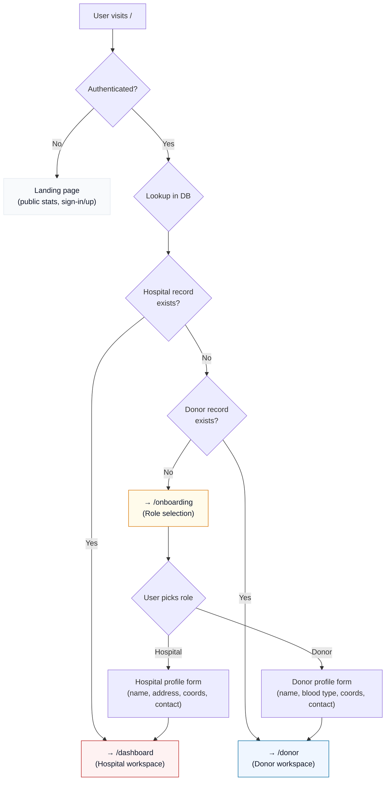

<](https://nextjs.org/)
[](https://www.typescriptlang.org/)
[](https://www.prisma.io/)
[](https://www.postgresql.org/)
[](https://clerk.com/)
[](https://tailwindcss.com/)
[](https://www.framer.com/motion/)

[](LICENSE)
[](https://github.com/Pro1943)

</div>

---

## 🚨 The Problem

When a hospital faces an emergency blood shortage, the process of finding compatible donors is still fragmented. Hospitals phone around, patients' families scramble on social media, and nearby willing donors have no way of knowing there's a need 5 km away. There is no shared coordination layer between hospitals and donors — no system that answers: *"Who nearby can actually donate right now, and is their blood type compatible?"*

Project BloodBank is a purpose-built coordination platform that connects hospitals and donors around three core workflows:

1. **Emergency requests** — hospitals publish urgent blood needs with type and unit counts
2. **Compatibility + proximity matching** — donors see only requests they can fulfill, within range
3. **Donation camps** — hospitals organize collective drives with capacity management and RSVP

---

## 🌐 Live Demo

**[→ project-blood-bank-plum.vercel.app](https://project-blood-bank-plum.vercel.app/)**

---

## 📸 Screenshots

### Hero



### 🏥 Hospital Workspace

| Dashboard | Blood Requests | Donor Management |
|:---------:|:--------------:|:----------------:|
|  |  |  |

| Donation Camps |
|:--------------:|
|  |

### 🩸 Donor Workspace

| Dashboard | Nearby Blood Requests |
|:---------:|:---------------------:|
|  |  |

---

## ✨ Key Features

### 🔐 Role-Based Authentication
- Clerk-powered sign-up/sign-in with role selection during onboarding (Hospital Admin or Donor)
- Middleware-protected routes — `/dashboard/*` for hospitals, `/donor/*` for donors
- Role stored in Clerk `publicMetadata`, checked server-side on every request

### 🩸 Blood Type Compatibility Matching
- Full ABO/Rh compatibility matrix — determines which donor types can safely donate to which recipient types
- Donors only see requests they are biologically compatible with — no noise, no false matches
- Compatibility enforced server-side before any contribution is recorded

### 📍 Haversine-Based Nearby Matching (50 km radius)
- Both donor-side and hospital-side nearby request views use the Haversine formula to compute great-circle distance between coordinates
- Requests are filtered to a 50 km radius and sorted by proximity — closest first
- Dual-context: works whether the authenticated user is a donor (matched by personal location) or a hospital (matched by hospital coordinates)

### 🏕️ Donation Camps with RSVP + Waitlist
- Hospitals create camps with title, address, date range, and max capacity
- Donors RSVP with one click — system tracks confirmed vs. waitlisted registrants
- Camp status auto-transitions: `UPCOMING → ACTIVE → COMPLETED` based on date window
- Automated cleanup removes completed/fulfilled records older than 30 days

### 🛡️ Consent-Respecting Availability System
- **Two-layer availability**: computed 56-day cooldown from last donation date *AND* a donor-controlled `isAvailabilityOptedIn` toggle
- A donor must pass both checks to appear as available — hospitals cannot override a donor's opt-out
- `lastDonationDate` updates automatically when a hospital records a contribution, restarting the 56-day cooldown

### 📞 Hospital Contact on Request Cards
- When donors browse nearby requests, each request card includes the hospital's name, phone, and email
- Contact info surfaces via a modal — donors can reach the hospital directly without intermediary steps

### 📊 Dashboard Analytics
- Hospital dashboard: open request count, upcoming camp count, registered donor count, critical request alerts with pulsing indicator
- Donor dashboard: compatible nearby request count, blood type display, upcoming camp count, cooldown progress indicator

---

## ⚙️ How It Works

### Emergency Request → Donor Match Flow



### Auth & Role Routing Flow



---

## 🛠️ Tech Stack

| Layer | Technology | Purpose |
|-------|-----------|---------|
| **Framework** | Next.js 16 (App Router) | Server components, API routes, file-based routing |
| **Language** | TypeScript 5 | End-to-end type safety |
| **Database** | PostgreSQL | Relational data — requests, donors, camps, RSVPs |
| **ORM** | Prisma 7 + `@prisma/adapter-pg` | Schema-first data modeling with driver adapter for edge compatibility |
| **Auth** | Clerk (`@clerk/nextjs` v7) | Authentication, role management via `publicMetadata` |
| **Styling** | Tailwind CSS v4 | Utility-first CSS with custom design tokens |
| **Animation** | Framer Motion | Micro-interactions, staggered list animations, expandable cards |
| **Validation** | Zod | Runtime schema validation for API inputs |
| **Icons** | Lucide React | Consistent icon system |
| **Deployment** | Vercel | Edge-optimized hosting with serverless functions |

---

## 🏗️ Architecture & Technical Highlights

### Blood Compatibility Matrix

The compatibility engine uses a lookup table mapping each recipient blood type to its list of safe donor types, following standard ABO/Rh transfusion rules. This is used both for filtering donor-visible requests and for server-side validation before recording any contribution.

### Haversine Distance Calculation

Proximity matching uses the Haversine formula — computing great-circle distance between two lat/lng coordinate pairs on a sphere with Earth's radius (6,371 km). The `calculateDistance()` utility handles degree-to-radian conversion and returns distance in kilometers, used to enforce the 50 km matching radius.

### Prisma Driver Adapter Setup

The project uses Prisma 7's driver adapter pattern (`@prisma/adapter-pg`) instead of the default Prisma engine binary. This enables direct PostgreSQL connections via the `pg` client with explicit SSL configuration, which is required for compatibility with serverless/edge deployment targets like Vercel.

### 🐛 The Caching Bug — A Real Engineering Challenge

**The problem:** After deploying to Vercel, the nearby-matching API route (`/api/requests/nearby`) was returning stale data. Donors would see requests that had already been fulfilled, or miss new requests entirely. The data was correct in the database but the API responses were frozen.

**Diagnosis:** Vercel's edge infrastructure aggressively caches `GET` route handler responses by default. The nearby-matching route was being cached at the CDN layer, so subsequent requests from different donors were all receiving the same pre-computed result — regardless of their individual location or blood type.

**The fix:** Two changes were required:
1. `export const dynamic = "force-dynamic"` — tells Next.js this route must be evaluated on every request, never statically cached
2. `Cache-Control: no-store, max-age=0` response header — prevents CDN and browser-level caching of the response

This is a common but non-obvious production issue with Next.js API routes on Vercel, and diagnosing it required understanding the interaction between Next.js route segment config, Vercel's CDN behavior, and HTTP cache semantics.

---

## 🚀 Getting Started

### Prerequisites

- Node.js 18+
- PostgreSQL database (local or hosted — [Neon](https://neon.tech), [Supabase](https://supabase.com), etc.)
- [Clerk](https://clerk.com) account (free tier works)

### Setup

```bash
# Clone the repository
git clone https://github.com/Pro1943/ProjectBloodBank.git
cd ProjectBloodBank

# Install dependencies
npm install

# Configure environment variables
# Create a .env file with the following keys:
```

| Variable | Description |
|----------|-------------|
| `DATABASE_URL` | PostgreSQL connection string |
| `NEXT_PUBLIC_CLERK_PUBLISHABLE_KEY` | Clerk publishable key |
| `CLERK_SECRET_KEY` | Clerk secret key |

```bash
# Push the schema to your database
npx prisma db push

# (Optional) Seed with sample data
npm run seed

# Start the dev server
npm run dev
```

The app will be running at `http://localhost:3000`.

---

## 📁 Project Structure

```
project_blood_bank/
├── prisma/
│   ├── schema.prisma          # Data models: Hospital, Donor, BloodRequest, DonationCamp, CampRSVP, BloodDonorContribution
│   └── seed.ts                # Sample data seeder
├── prisma.config.ts           # Prisma driver adapter config (DATABASE_URL binding)
├── src/
│   ├── app/
│   │   ├── page.tsx           # Landing page (public) with auto-redirect for authenticated users
│   │   ├── layout.tsx         # Root layout — ClerkProvider, Inter font, global styles
│   │   ├── sign-in/           # Clerk sign-in page
│   │   ├── sign-up/           # Clerk sign-up page
│   │   ├── onboarding/        # Role selection → profile form (hospital or donor)
│   │   ├── dashboard/         # Hospital workspace: dashboard, requests, camps, donors, profile
│   │   ├── donor/             # Donor workspace: dashboard, nearby requests, camps, profile
│   │   └── api/
│   │       ├── requests/      # CRUD for blood requests + nearby matching + contributions
│   │       ├── camps/         # CRUD for donation camps + RSVP
│   │       ├── donors/        # Donor listing and profile
│   │       ├── hospital/      # Hospital-specific donor queries
│   │       ├── hospitals/     # Hospital profile and listing
│   │       └── maintenance/   # Automated cleanup of stale data
│   ├── components/
│   │   ├── app-shell.tsx      # Shared layout shell with role-aware sidebar navigation
│   │   ├── header-client.tsx  # Client-side header with Clerk user button
│   │   ├── landing-content.tsx# Animated landing page content (stats, features)
│   │   └── ui/               # Reusable components: RequestCard, CampCard, DonorCard,
│   │                         #   BloodTypeBadge, UrgencyBadge, CooldownIndicator, etc.
│   ├── lib/
│   │   ├── auth.ts            # Role checking utilities (getUserRole, checkUserRole)
│   │   ├── availability.ts    # 56-day cooldown + opt-in availability logic
│   │   ├── blood-compatibility.ts  # ABO/Rh compatibility matrix
│   │   ├── camp-status.ts     # Effective camp status computation from date window
│   │   ├── countries.ts       # Country code list for phone number input
│   │   ├── db.ts              # Prisma client with pg driver adapter + SSL config
│   │   ├── distance.ts        # Haversine formula for coordinate distance
│   │   └── maintenance.ts     # Auto-sync camp statuses + cleanup old completed data
│   └── proxy.ts               # Clerk middleware — protects /dashboard, /donor, /onboarding
└── images/                    # Screenshots for README
```

---

## 📚 Learning Outcomes

Building this project deepened understanding across several areas:

- **Full-stack TypeScript architecture** — structuring a Next.js 16 App Router project with clear separation between server components, client components, and API route handlers
- **Relational data modeling** — designing a normalized schema with Prisma that handles many-to-many relationships (donors ↔ requests via contributions, donors ↔ camps via RSVPs) and cascading deletes
- **Production deployment debugging** — diagnosing and fixing the Vercel CDN caching issue required understanding the full request lifecycle from Next.js route config → Vercel edge → browser cache
- **Domain logic in code** — implementing the blood compatibility matrix and Haversine distance formula as pure TypeScript utilities, testable and reusable
- **Auth and authorization patterns** — role-based access control using Clerk's `publicMetadata`, enforced at both the middleware layer (route protection) and the API layer (ownership checks)
- **Consent-first design** — building an availability system where the donor always has final say over their visibility, layered on top of computed medical eligibility

---

## 🔮 Future Roadmap

- **Dynamic radius by urgency** — CRITICAL requests could expand the matching radius beyond 50 km to reach more potential donors, while STANDARD requests stay local
- **Cross-hospital request relay** — when a hospital's local donor pool can't fulfill a request, the system could relay the request to nearby hospitals, creating a cooperative network rather than isolated silos

---

## 📄 License

This project is licensed under the [MIT License](LICENSE).

---

<div align="center">

Built by [@Pro1943](https://github.com/Pro1943)

</div>
]]>
